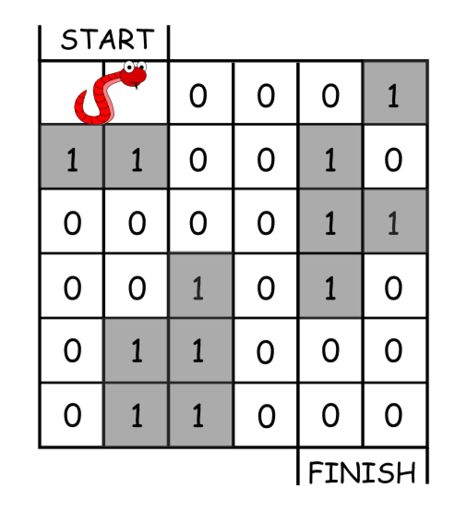

# Engineer Pro Test Round 2

Code và một chút suy nghĩ của mình về các vấn đề sau bài thi round 2 của 
nhóm admin [Engineer Pro](https://www.facebook.com/EngineerPro.Official).
Đề thi gồm 4 câu hỏi, 3 Hard và 1 Medium lấy trực tiếp từ problem set của
[LeetCode](https://leetcode.com/problemset/all/)

## [Largest Rectangle in Histogram](https://leetcode.com/problems/largest-rectangle-in-histogram/description/)

Đề bài yêu cầu tìm diện tích hình chữ nhật lớn có thể từ một biểu đồ cột cho
trước dưới dạng mảng. Ví dụ:


*Input: heights = [[2,1,5,6,2,3]] -> Output: 10*

Ý tưởng đơn giản nhất ở đây là với mỗi phần tử, ta có thể tìm được hình chữ 
nhật có diện tích lớn nhất tạo từ phần tử đó bằng cách sử dụng 2 con trỏ
xuất phát từ vị trí phần tử đó, một con trỏ chạy sang trái một con trỏ chạy
sang phải. Các con trỏ sẽ dừng lại khi gặp cột có độ dài lớn hơn cột đang xét
và để ý rằng 2 cột cao bằng nhau ở cạnh nhau sẽ cho ra đầu ra như nhau.

Cách làm tuy đơn giản này lại có thể giúp mình pass đến 96/98 test
(tle ở test thứ 97) 

```python
class Solution:
    def largestRectangleArea(self, heights: List[int]) -> int:
        max_area = 0
        n = len(heights)
        for i in range(n):
            if i > 0 and  heights[i] == heights[i - 1]:
                continue
            j = i + 1
            k = i - 1
            rectangle = heights[i]
            left = 0
            right = 0
            while j < n and heights[j] >= heights[i] :
                right += heights[i]
                j += 1
            if i > 0 and heights[i-1] > heights[i]:
                while k >= 0 and heights[k] >= heights[i]:
                    left += heights[i]
                    k -= 1
            rectangle = rectangle + left + right
            if rectangle > max_area:
                max_area = rectangle
        return max_area
```

Sau đó mình có thử ngồi tối ưu một số bước theo hướng đi này nhưng đều
không ra kết quả. Ở đây có thể thấy bài toán này là một vấn đề mở rộng 
của Skyline Problem:
<p align="center" width="100%">
    
</p>

*Cho N người cùng xếp hàng theo một hàng ngang. Mỗi 
người đều chỉ nhìn thây người gần nhất bên trái cao hơn mình.
Người thứ i có chiều cao là heights[i], cần tìm view[i] là vị trí của người 
mà người i nhìn thấy.*

Cách làm chung cho các dạng bài kiểu này dùng 1 stack để chứa index các
phần tử. Duyệt qua mảng heights, với mỗi phần tử thứ i:
- Pop các phần tử ra khỏi stack cho đến khi gặp phần tử lớn hơn height[i]
- Cập nhật kết quả max_area
- Push i vào stack

Cách làm này đã khắc phục điểm yếu phải duyệt qua cả mảng với mỗi phần tử
như cách làm đầu tiên( độ phức tạp `O(n^2)`) giúp mình pass hoàn toàn bộ test

````python
class Solution:
    def largestRectangleArea(self, heights: List[int]) -> int:
        stack = []
        max_area = 0
        i = 0
        while i < len(heights):
            if not stack or heights[i] >= heights[stack[-1]]:
                stack.append(i)
                i += 1
            else:
                top = stack.pop()
                area = heights[top] * (i if not stack else i - stack[-1] - 1)
                max_area = max(max_area, area)
        while stack:
            top = stack.pop()
            area = heights[top] * (i if not stack else i - stack[-1] - 1)
            max_area = max(max_area, area)
        return max_area
````

## [Minimum Moves to Reach Target with Rotations](https://leetcode.com/problems/minimum-moves-to-reach-target-with-rotations/description/)

Bài toán yêu cầu tìm số bước ngắn nhất cho chú rắn đến đích trên 1 
ma trận lưới `N x N`. Chú rắn sẽ chiếm vị trí 2 ô, một ô đầu và 1 ô đuôi.
Con rắn chỉ được làm 1 trong 2 hành động:
- Dịch cả đầu lẫn đuôi sang bên phải hoặc xuống dưới 1 ô
- Quay đầu 1 ô lấy đuôi là tâm(có thể quay thuận hoặc ngược chiều kim đồng hồ)


Vd:

<p align="center" width="100%">
    
</p>

*Input: grid = [[0,0,0,0,0,1],
               [1,1,0,0,1,0],
               [0,0,0,0,1,1],
               [0,0,1,0,1,0],
               [0,1,1,0,0,0],
               [0,1,1,0,0,0]]*\
*Output: 11*

Với các kiểu bài dạng tìm đường ngắn nhất trên lưới này, hầu như chỉ 
có 1 cách là BFS duyệt tất cả đường đi có thể và quy hoạch động lưu
những bước đi qua. Có 2 nhận xét:
- Với một vị trí (m,n) bất kì trên lưới, số khoảng cách để đi từ điểm (0,0) đến điểm đó luôn là m + n - 1 cho dù đi theo cách nào.
- Phép quay chỉ làm đổi chiều đầu rắn chứ không giảm số lượng khoảng cách, nên luôn ưu tiên phép dịch nếu có thể.

Nhìn chung, cách tư duy bài toán không quá khó mà khó nằm ở phần code, một khi lần đầu tiên đã không ăn được
ngay thì rất có thể sẽ mất rất nhiều thời gian để debug. Full code có trong file `minimum_move.py`

## [Maximum Number of Events That Can Be Attended](https://leetcode.com/problems/maximum-number-of-events-that-can-be-attended/description/)

Cho một dãy các sự kiện `events[i] = [startDayi, endDayi]`. Có thể tham gia 
bất cứ ngày nào thời gian diễn ra sự kiện nhưng mỗi ngày chỉ được tham gia một sự kiện.
Tìm số sự kiện lớn nhất tham gia được.

<p align="center" width="100%">
    
</p>

*Input: events = [[1,2],[2,3],[3,4]]\
Output: 3*

Nhận xét: Nếu sắp xếp lại các sự kiện tuyến tính theo ngày bắt đầu thì khi
duyệt lần lượt từng sự kiện, cách tốt nhất để tham gia 1 sự kiện là tham gia
càng gần ngày bắt đầu càng tốt.

Với suy nghĩ trên có thể ăn được 42/44 test bằng cách làm Tham lam sau:

````python
class Solution:
    def maxEvents(self, events: List[List[int]]) -> int:
        events.sort(key=lambda x: x[1])
        attended = set()
        for event in events:
            for day in range(event[0], event[1] + 1):
                if day not in attended:
                    attended.add(day)
                    break
        return len(attended)
````

Đến đây vì đồng hồ chỉ còn ~20 phút nên mình không tối ưu mà sang bài sau luôn.
Lời giải ăn full testcase sử dụng heap ở `maximum_event.py`

## [Basic Calculator](https://leetcode.com/problems/basic-calculator/description/)

Lại 1 bài kinh điển nữa về stack. Yêu cầu tìm kết quả của phép tính cơ bản( chỉ có các dấu '+', '-', '(', ')')
cho dưới dạng string. Ví dụ:\
*Input: s = "(1+(4+5+2)-3)+(6+8)"\
Output: 23*\

Bài này mình đã được học. Cách làm là:
- Sử dụng 1 stack để lưu phép tính và phần tử
- Lần lượt duyệt qua các phần tử trong s:
  - Nếu đó là phép tính, push nó vào stack
  - Nếu đó là phần tử, ta xét stack:
    - Nếu phép tính trên đỉnh stack là phép không ưu tiên( + , -), push vào stack
    - Nếu phép tính trên đỉnh stack là phép ưu tiên( * , /, dấu ngoặc):
      - Pop 2 phần tử trên đỉnh stack ra, 1 là phép tính và 1 là phần tử
      - Thực hiện phép tính đó trên phần tử đang duyệt và phần tử vừa pop. Push kết quả lại stack
- Sau các bước trên  thì stack chỉ còn các phần tử và các phép không ưu tiên, lần lượt lấy ra tính kết quả

Đáng tiếc là lúc đó thời gian hết nên mình không debug kịp, chỉ ăn
được 31/45 test

````python
class Solution:
    def calculate(self, s: str) -> int:
        return self.parse_expr(s, 0)[0]

    def parse_expr(self, s, i):
        stack = []
        num = 0
        sign = '+'
        while i < len(s):
            if s[i].isdigit():
                num = num * 10 + int(s[i])
            elif s[i] == '(':
                num, i = self.parse_expr(s, i + 1)
            if (not s[i].isdigit() and s[i] != ' ') or i == len(s) - 1:
                if sign == '+':
                    stack.append(num)
                elif sign == '-':
                    stack.append(-num)
                num = 0
                sign = s[i]
            if s[i] == ')':
                return sum(stack), i
            i += 1
        return sum(stack), i
````

## Tổng kết

Nhìn chung đề thi không quá khó, có nhiều câu hard nhưng đều là vấn đề 
kinh điển có thể làm được nếu học rồi, cám ơn đội ngũ admin [Engineer Pro](https://www.facebook.com/EngineerPro.Official) có tâm vì không giao mấy bài đánh đố :V. Hơi tiếc vì nếu sắp xếp thời gian và
thứ tự làm bài tốt hơn thì mình đã có thể ăn được full đề. Hy vọng kiến thức mình note ra ở đây có thể giúp được các bạn. Bye!!!


